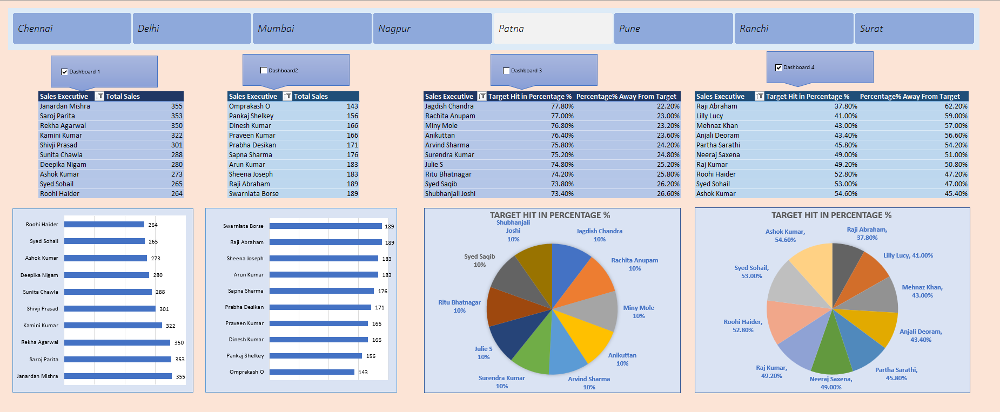

# Sales Performance Dashboard - Excel Project

##  Project Overview

This is an interactive **Sales Performance Dashboard** created using Microsoft Excel. It visualizes the sales data of executives across different cities in India (Chennai, Delhi, Mumbai, Nagpur, Patna, Pune, Ranchi, Surat) through pivot tables, charts, and slicers. The dashboard is enhanced with **VBA macros and recorded scripts** for dynamic interactivity.

</img>

---

##  Features

- City-wise dashboards with clickable slicers.
- Pivot tables and charts to summarize:
  - Total Sales per Executive
  - Target Hit % and Away from Target %
- Horizontal bar charts and pie charts for quick insights.
- Buttons to switch between dashboards.
- Clean and intuitive layout with formatted visuals.

---

##  Tools & Technologies Used

- **Microsoft Excel**
- **Pivot Tables**
- **Pivot Charts**
- **Slicers**
- **VBA Macros** (for dashboard switching and interactivity)

---

## 🚀 How to Use

1. Download the `Sales_Data_Analysis.xlsx` file.
2. Open in Microsoft Excel .
3. Enable **Macros** and **Active Content** when prompted.
4. Use the slicers and dashboard buttons to explore different city-wise reports.

---
